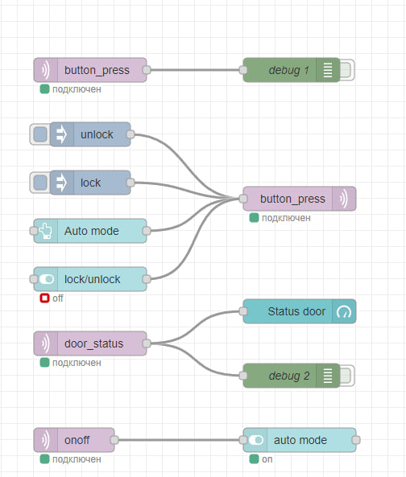
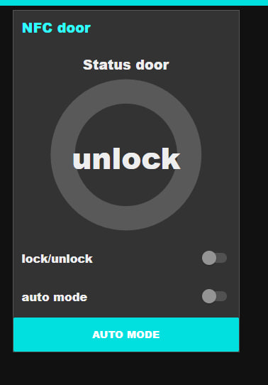
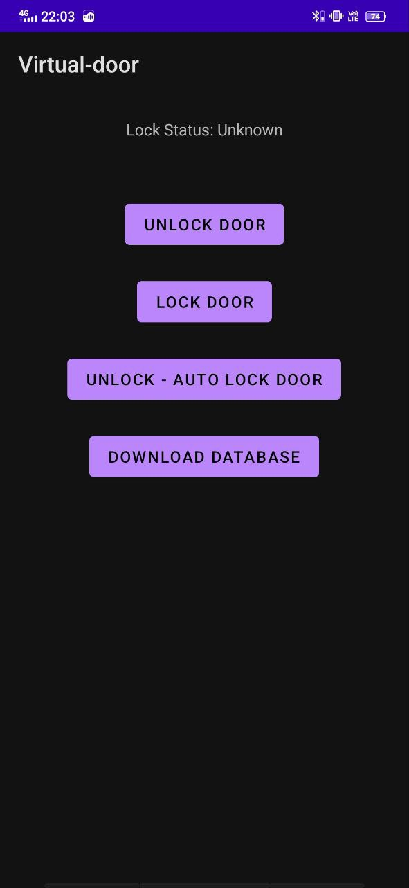
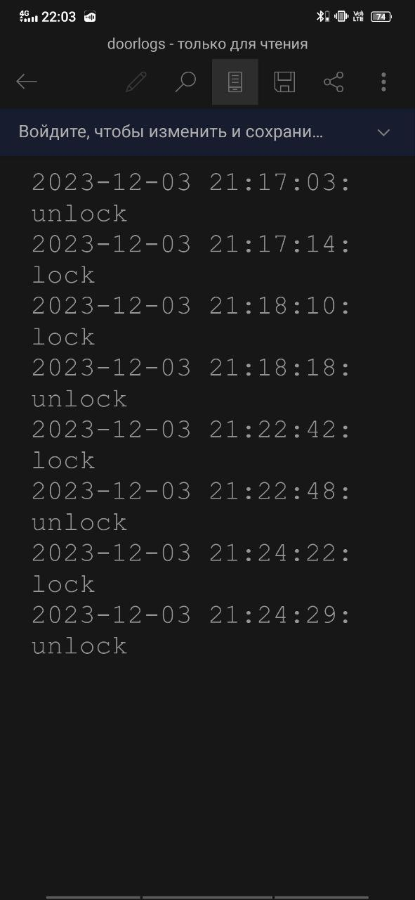

<h1 style="text-align:center">Краткая информация РГР.</h1>
<h3>1. Код основной программы.</h3>
<h3><a href="https://github.com/TimurGayazov/NodeRed/blob/main/NFC-door/nfc_door_lab.py">nfc_door_lab.py</a></h3>
<h3>2. Узлы nodeRed.</h3>

<h3>3. Изменение параметров виртуального замка.</h3>

<h3>4. Приложение для управления виртуальным замком.</h3>
<h3><a href="https://github.com/TimurGayazov/NodeRedApp">Мобильное приложение</a></h3>

<h3>5. Запись изменений в базу данных на телефона в формате '.txt'.</h3>
