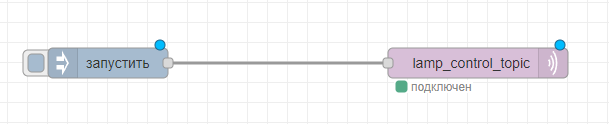

<h1>Краткая информация проекта</h1>
<h3>1. Код основной программы - 1.1lab.py</h3>
<h3>2. Запрос на смену цвета и яркости вирутальной лампочки - publish_message.py</h3>
<h3>3. Узлы nodeRed для передачи параметров лампы</h3>
