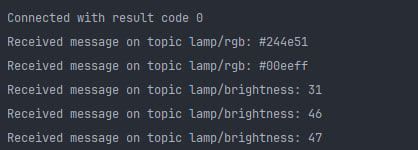

<h1 style="text-align:center">Краткая информация проекта</h1>
<h3>1. Код основной программы - lamp_lab.py</h3>
<h3>2. Узлы nodeRed </h3>

<h3>3. Изменение параметров лампы в Dashboard </h3>

<h3>4. Вывод изменений в консоль </h3>

<h3>5. Запись изменений в бд (sqlite3) </h3>
